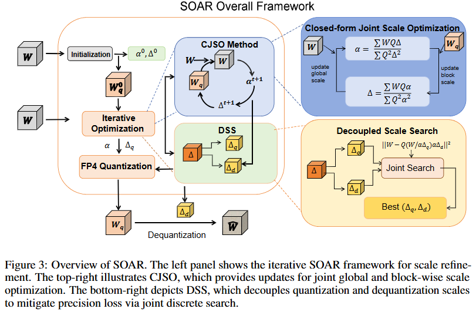
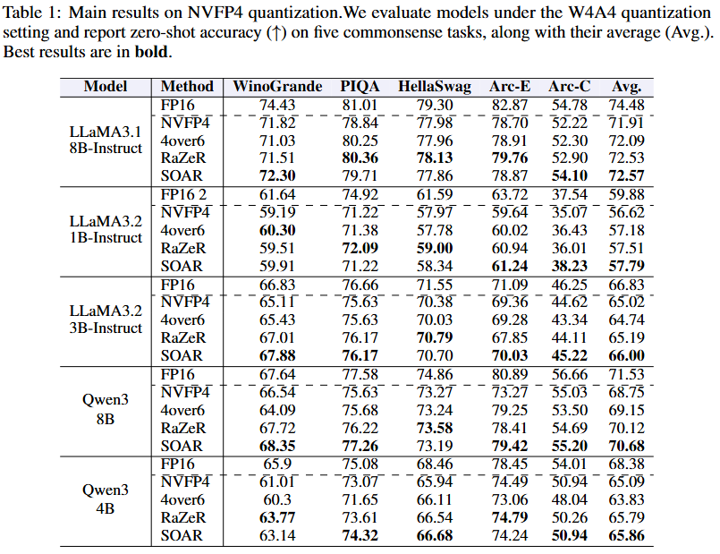

# SOAR: Scale Optimization for Accurate Reconstruction in NVFP4 Quantization

  
  
  

  <a href="https://github.com/steven-bao1">ChengZhu Bao</a>, 
  <a href="https://xianglongyan.github.io/">Xianglong Yan</a>, 
  <a href="https://zhitengli.github.io">Zhiteng Li</a>, 
  Guangshuo Qin, 
  Guanghua Yu, 
  <a href="http://yulunzhang.com/">Yulun Zhang</a>

---

#### 🔥 News

- **2026-05-12:** This repository is officially released!

---

> **Abstract:** NVFP4 has recently emerged as an efficient 4-bit microscaling format for large language models (LLMs), offering superior numerical fidelity with native hardware support. However, existing methods often yield suboptimal performance due to inflexible scale selection and the coupled treatment of quantization and dequantization scales. To address these issues, we propose **Scale Optimization for Accurate Reconstruction (SOAR)**, a novel post-training quantization framework that improves the accuracy of NVFP4 quantization. At its core, SOAR features **Closed-form Joint Scale Optimization (CJSO)**, which jointly optimizes global and block-wise scales via analytical solutions derived from reconstruction error minimization. Furthermore, it incorporates **Decoupled Scale Search (DSS)**. DSS decouples the high-precision quantization scale from its constrained dequantization counterpart, and performs discrete search to mitigate precision loss from scale quantization. Extensive experiments across multiple LLMs show that our method consistently outperforms existing NVFP4 quantization baselines, achieving superior accuracy under the same memory footprint with no additional hardware overhead.

  

---

## ⚒️ TODO

* [ ] Complete this repository

## 🔗 Contents

- [ ] Post-training quantization
- [ ] Models
- [ ] [Results](#-results)
- [ ] [Citation](#-citation)
- [ ] [Acknowledgements](#-acknowledgements)

## 🔎 Results

SOAR consistently outperforms state-of-the-art NVFP4 quantization methods (such as RaZeR and 4over6) across various benchmarks including MMLU, GSM8K, and common-sense reasoning tasks.

📊 Click to view experimental results (experiment.png)

  

## 💡 Acknowledgements

This work is released under the Apache 2.0 license.
